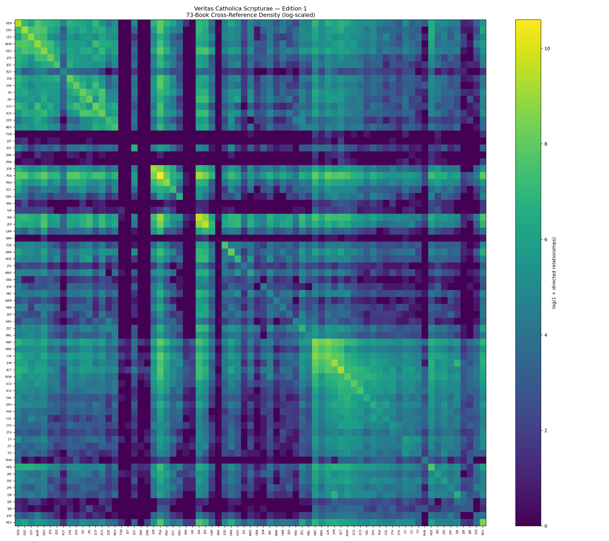
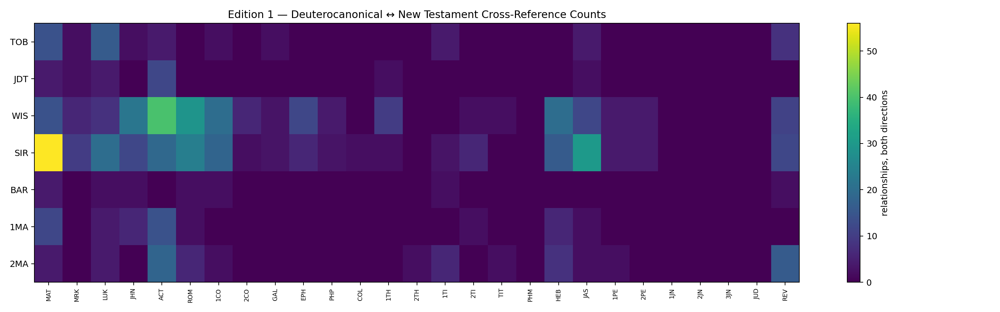

# Veritas Catholica Scripturae
### The Catholic 73-Book Scripture Cross-Reference Concordance

**Edition 1:** 1,171,415 reconciled directed relationships across a Catholic 73-book research framework.

## What makes VCS different?
Most large machine-readable Bible cross-reference projects center on the Protestant 66-book canon. VCS preserves that valuable existing work while exposing Catholic/Deuterocanonical relationships and their provenance.

### Edition 1
- **580,351** multi-source relationships
- **590,391** single-established-source relationships
- **673** relationships reserved for scholar review
- **920** Deuterocanonical relationships
- **701** Deuterocanon ↔ New Testament relationships

## Explore

## Research caution
A cross-reference is evidence of a documented relationship, not automatically proof of quotation, literary dependence, canonicity, or doctrine. VCS preserves the evidence so scholars and readers can investigate those questions transparently.

[Repository home](https://github.com/cftrevizo/Veritas-Catholica-Scripturae)
